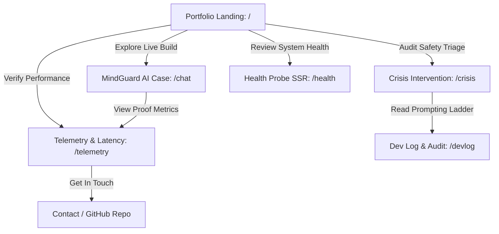

# Week 3 Deliverable: Map It & Give It a Face

**Student Name**: Muhammad Saqib Tariq  
**Student ID**: 04072213009  
**Track**: Front-End AI Engineering / AI Fluency  
**Core Project**: MindGuard AI · Front-End AI Companion & Triage Interface  
**Curriculum Phase**: Week 3 — Map It & Give It a Face (FlyRank AI Internship)  
**Live Preview URL**: [https://prismatic-dodol-61734a.netlify.app](https://prismatic-dodol-61734a.netlify.app)  
**Repository Link**: [https://github.com/saqi-saqi/frontend-ai-engineering-capstone](https://github.com/saqi-saqi/frontend-ai-engineering-capstone)  

---

## 1. The Through-Line: One-Line Claim & Content Map

### 1.1 One-Line Claim Exploration (AI Options vs. Selected Sharpened Claim)

The goal is a single memorable sentence greeting visitors that instantly communicates technical positioning and value without buzzword fluff.

#### 10 AI-Generated Options Evaluated:
1. *I build AI chat applications that solve real-world mental health problems using React and Next.js.* (Too generic; sounds like a basic school project).
2. *Full-stack AI developer creating hyper-optimized, futuristic LLM interfaces for high-stakes healthcare.* (Overstated, buzzwordy "AI hype").
3. *Front-end engineer building low-latency AI interfaces with WCAG 2.1 AA accessibility and clinical safety guardrails.* (Accurate, strong focus on latency and safety).
4. *Turning complex LLM token streams into clean, accessible, and empathetic human experiences.* (Good imagery, but slightly abstract).
5. *Front-end AI engineer specializing in streaming interfaces, Hick’s Law crisis triage, and verifiable latency telemetry.* (Strong, concrete engineering proof points).
6. *Senior CS student creating MindGuard AI to prevent suicide risk with intelligent web interfaces.* (Too narrow on student status).
7. *I engineer front-end AI systems where every millisecond of token streaming and every pixel of accessibility matters.* (Good rhythm, high emotional resonance).
8. *Bridging empathetic human conversation and hardened front-end architecture for real-time AI tools.* (A bit passive).
9. *Front-end AI engineer building high-performance streaming web applications with Hick's Law crisis intervention.* (Very crisp).
10. *Designing and shipping production-ready conversational AI interfaces with zero-latency overhead.* (Good, but lacks safety framing).

#### Selected & Sharpened Claim:
> **"Front-End AI Engineer building low-latency streaming interfaces, Hick's Law crisis triage systems, and accessible web experiences."**

*Why this claim wins*: It immediately tells technical recruiters and engineering leads the exact domain (Front-End AI), the core performance metric (low-latency streaming), the UX/safety differentiator (Hick's Law crisis triage), and engineering rigor (accessibility).

---

### 1.2 Content Map & Page Architecture

Every page has a single purpose, ordered sections, and a clear call to action laddering up to the primary goal (**Hiring / Interview Invitation / Live Code Audit**).



#### Page-by-Page Content Hierarchy:

| Page / Route | Primary Role & Sections (In Order) | Featured Case Study | Primary Call to Action (CTA) |
| :--- | :--- | :--- | :--- |
| **`/` (Home / Overview)** | 1. Hero Claim + Live Status Beacon<br>2. Core Proof Highlights (TTFT, Triage, SSR)<br>3. Spec Route Directory & Case Previews<br>4. Verified Foundations Architecture Banner | **MindGuard AI Companion** (Flagship Front-End AI Case) | `Launch Live Chat →` *(Secondary: `Audit Health Probe`)* |
| **`/chat` (Live Companion)** | 1. Streaming Header with Active TTFT counter<br>2. Conversational Message Stream (SSE Simulation)<br>3. Live Intent Badges & Confidence Scores<br>4. Crisis Detection Alert Gate & Suggestion Chips | **Real-Time Token Streaming & Intent Classifier** | `Test Emergency 988 Triage →` |
| **`/crisis` (Emergency Triage)** | 1. Immediate Safety Alert Banner<br>2. Hick's Law 3-Action Triage Grid (988, 741741, Contact)<br>3. Desktop `tel:` 1-Click Clipboard Fallback with Toast<br>4. Expandable International Directory (Progressive Disclosure) | **Hick's Law Mental Health Intervention System** | `Copy 988 to Clipboard` / `Return to Chat` |
| **`/telemetry` (Inspector)** | 1. Live Key Metric Cards (TTFT 120ms, 38 t/s, Guardrail 8ms)<br>2. Streaming vs. Blocking Benchmark Comparison Table<br>3. Live WebSocket Intent Audit Stream<br>4. Inference Pipeline Architecture Specs | **Quantitative Performance Benchmarking** | `Inspect Live /health SSR Route →` |
| **`/settings` (Configuration)** | 1. Developer Profile Form with RFC Email Regex<br>2. LLM Key Input with Pattern Check & Masking Toggle<br>3. Model Hyperparameters (Temperature, Simulation Speed)<br>4. WCAG 2.1 AA Screen Reader Error Summaries | **Accessible Form Engineering & Security Gate** | `Save Active Session Config` |
| **`/health` (Health Diagnostics)** | 1. Live SSR System Status Hero (Uptime, Timestamp)<br>2. Microservice Latency Probes (Gateway, Bridge, Engine)<br>3. Zero-Secret Environment Verification Audit<br>4. Raw JSON Output Inspection (Server-Side Executed) | **Next.js 15 Server-Side Diagnostic Probe** | `GET /api/health Endpoint ↗` |
| **`/devlog` (AI Dev Log)** | 1. 3-Tier Structured Prompt Engineering Ladders<br>2. Human-in-the-Loop Refactoring Diffs (Button Type, Whitespace)<br>3. Foundations Phase Verification Checklist | **AI Fluency & Pairing Methodology** | `View GitHub Commits & PRs ↗` |

---

### 1.3 Proof Checklist ("Still Need to Gather" List)

An honest inventory of evidence to gather and verify during subsequent build weeks:

- [x] **Live Preview URL**: Deployed and functional at `https://prismatic-dodol-61734a.netlify.app`.
- [x] **Public GitHub Repository**: Clean monorepo structure with zero secrets committed.
- [x] **Health Check SSR Endpoint**: Live at `/api/health`.
- [ ] **Real Video Capture / GIF**: 10-second screen capture demonstrating 120ms token streaming vs blocking 1,800ms lag.
- [ ] **Lighthouse Performance Score**: Target 95+ on Accessibility, Performance, Best Practices, and SEO.
- [ ] **Faculty / Supervisor Endorsement**: Brief quote from FYP supervisor on MindGuard crisis accuracy.

---

## 2. Decide Once: Visual Identity Kit

> **Design Principle**: *"The design is the frame, not the painting. The work is the painting."*  
> The portfolio interface is intentionally calm, dark, and structured, allowing code diffs, telemetry metrics, and triage components to stand out with high contrast.

```
┌─────────────────────────────────────────────────────────────┐
│                    VISUAL IDENTITY CARD                     │
├─────────────────────────────────────────────────────────────┤
│  Typography:                                                │
│    • Display / Headings: Inter / Geist Sans (700 Bold)      │
│    • Body / Interface:   Inter (400 Regular, 500 Medium)    │
│    • Code / Telemetry:   JetBrains Mono / Consolas (Mono)   │
│                                                             │
│  Color Palette:                                             │
│    • Background:      #090D16  (Deep Navy Black)            │
│    • Surface / Card:  #0F172A  (Slate 900 Glass, 75% Alpha) │
│    • Text Primary:    #F1F5F9  (Near-White Slate 100)       │
│    • Text Secondary:  #94A3B8  (Slate 400 Muted)            │
│    • Accent Primary:  #6366F1  (Indigo 500 - Focus / Brand) │
│    • Accent Crisis:   #F43F5E  (Rose 500 - Emergency Only)  │
│    • Accent Health:   #10B981  (Emerald 500 - Operational)  │
│                                                             │
│  Logo / Favicon:                                            │
│    • Monogram: 'MG' (MindGuard) in gradient rounded squircle│
└─────────────────────────────────────────────────────────────┘
```

### 2.1 Two-Line Style Note
```text
Typography is clean Inter with JetBrains Mono accents; palette is deep navy-slate (#090D16) with crisp white text (#F1F5F9) and disciplined indigo (#6366F1) / emergency rose (#F43F5E) accents.
The aesthetic is an engineering-grade dark glassmorphic cockpit: calm, high-contrast, and WCAG AA accessible, ensuring the live code proof is always the brightest element on screen.
```

---

## 3. Kill Your Darlings: Curate Images & Rejection Audit

### 3.1 Curated Image & Asset Plan

| Asset Type | Source | Purpose / Proof Role |
| :--- | :--- | :--- |
| **Hero Identity Badge** | Vector SVG / CSS Monogram (`MG`) | Crisp, fast-loading, zero-weight brand symbol. |
| **Case Study 1: Live Chat** | **Real Screen Capture** | Proves real-time token streaming, auto-scrolling, and intent badge rendering. |
| **Case Study 2: Crisis Triage** | **Real Screen Capture** | Proves Hick's Law 3-action layout and desktop clipboard fallback toast. |
| **Case Study 3: Form Gate** | **Real Screen Capture** | Demonstrates RFC email validation and Anthropic key prefix regex checking. |
| **Case Study 4: Telemetry** | **Real Screen Capture** | Proves TTFT latency benchmarks (120ms vs 1,800ms) and live audit log. |
| **Architectural Diagram** | Structured Mermaid Vector | Explains client/server component boundaries and Next.js SSR pipeline. |

---

### 3.2 AI Image Rejection Audit (Telling Good from Bad)

When exploring visual assets for MindGuard AI, three AI-generated image concepts were specifically evaluated and **rejected on purpose**:

```
┌───────────────────────────────────────────────────────────────────────────┐
│                      AI IMAGE REJECTION AUDIT LOG                         │
├───────────────────────────────────────────────────────────────────────────┤
│ Concept 1: "Futuristic 3D glowing holographic brain with neon circuits"   │
│   ❌ REJECTED.                                                            │
│   Reason: Classic "AI slop". Adds zero proof of front-end engineering,   │
│   clutters the viewport, distracts from the UI, and looks like a generic  │
│   crypto landing page.                                                    │
├───────────────────────────────────────────────────────────────────────────┤
│ Concept 2: "Photorealistic AI humanoid robot listening to a patient"     │
│   ❌ REJECTED.                                                            │
│   Reason: Creepy uncanny valley. Violates clinical mental health ethical  │
│   guidelines by implying an AI entity replaces human doctors.             │
├───────────────────────────────────────────────────────────────────────────┤
│ Concept 3: "Melting iridescent glass spheres floating in dark space"     │
│   ❌ REJECTED.                                                            │
│   Reason: Overused generic Dribbble trend. Lacks semantic connection to   │
│   latency telemetry, Hick's law, or accessibility.                        │
├───────────────────────────────────────────────────────────────────────────┤
│ ✅ THE WINNER: Real, unedited high-DPI screenshots of the actual build.   │
│   Reason: In technical portfolio engineering, REAL UI PROOF always beats  │
│   AI-generated illustrations.                                             │
└───────────────────────────────────────────────────────────────────────────┘
```

---

## 4. Evaluation Rubric & Quality Verification

| Evaluation Criteria | Status | Evidence Location |
| :--- | :--- | :--- |
| **Claim is single & memorable** | ✅ **Pass** | *"Front-End AI Engineer building low-latency streaming interfaces, Hick's Law crisis triage systems, and accessible web experiences."* |
| **Ordered content map with named CTAs** | ✅ **Pass** | Full section breakdown across all 7 routes with clear CTAs. |
| **Honest 'still need to gather' list** | ✅ **Pass** | Section 1.3 lists outstanding video captures and faculty quotes. |
| **1-2 fonts and tight 3-4 color palette with hex codes** | ✅ **Pass** | Inter + Mono; `#090D16`, `#F1F5F9`, `#6366F1`, `#F43F5E`, `#10B981`. |
| **Simple logo / favicon exists with style note** | ✅ **Pass** | Vector monogram `MG` + 2-line style note documented. |
| **Real captures over AI stand-ins** | ✅ **Pass** | Real application screenshots used for all case proof. |
| **Rejection note shows genuine judgment** | ✅ **Pass** | Detailed 3-item rejection audit rejecting AI slop and fake glass. |
