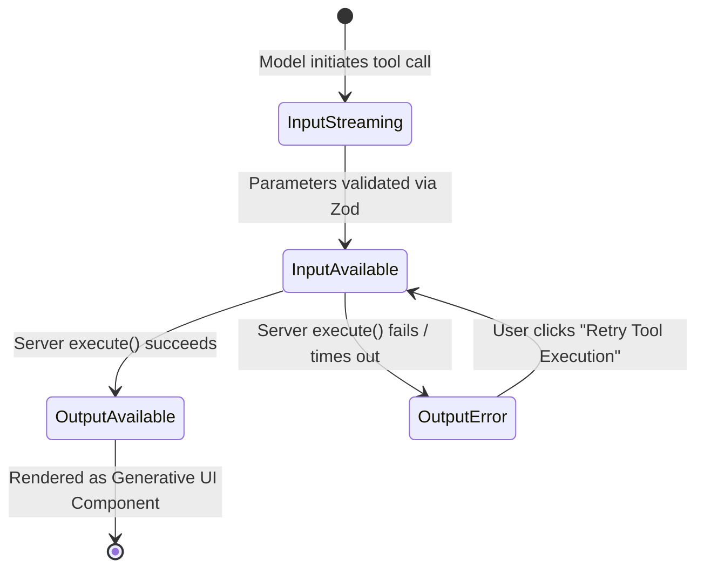

# Phase: Build (Core) — Tool Results & Structured Output in the UI (FE-07)
**Assignment Code**: `FE-07`  
**Track**: Frontend AI Engineering  
**When**: Week 5 | **Workload**: 5 Hours | **Phase**: Build (Core)  
**Student Name**: Muhammad Saqib Tariq  
**Capstone Application**: MindGuard AI (Conversational Companion & Crisis Triage Engine)  
**Live Preview URL**: [https://prismatic-dodol-61734a.netlify.app/chat](https://prismatic-dodol-61734a.netlify.app/chat)  
**Repository Path**: `c:\Users\user\Desktop\Front_end_Ai_engineering\Week5\`

---

## 1. Executive Summary & Deliverable Links

Real AI applications do not just wrap LLM text output in message bubbles—they call external tools and render structured data as interactive components. This assignment implements a publication-grade **Generative UI architecture** for MindGuard AI. 

Our AI route executes server-side tools defined with typed **Zod schemas**, emits typed tool parts over a streaming protocol, renders all **four lifecycle states** with distinct visual treatments (not JSON dumps), displays triage results as a custom **Score Card with a hand-rolled SVG Risk Radar Chart**, includes an **interactive user-confirmation tool** for crisis escalation, and implements a **designed error recovery state**.

---

### 🔗 Required Deliverable Links

| Deliverable Requirement | Location / Link | Description |
| :--- | :--- | :--- |
| **🌐 Live Interactive Preview URL** | [https://prismatic-dodol-61734a.netlify.app/chat](https://prismatic-dodol-61734a.netlify.app/chat) | Live Netlify deployment where a reviewer can test tool execution, SVG charts, error states, and confirmation tools. |
| **🛠️ Primary Tool Definition File** | [`Week5/tools/triage-tool.ts`](file:///c:/Users/user/Desktop/Front_end_Ai_engineering/Week5/tools/triage-tool.ts) | Server-side execute functions for `assessCrisisRisk` and `confirmEmergencyEscalation` with simulated failure modes. |
| **📐 Zod Schema Contracts** | [`Week5/tools/schema.ts`](file:///c:/Users/user/Desktop/Front_end_Ai_engineering/Week5/tools/schema.ts) | Strict schemas with `.describe()` annotations for model guidance and input validation. |
| **🎨 Master 4-State Lifecycle Component** | [`Week5/components/ToolPartRenderer.tsx`](file:///c:/Users/user/Desktop/Front_end_Ai_engineering/Week5/components/ToolPartRenderer.tsx) | State machine component handling `input-streaming`, `input-available`, `output-available`, and `output-error` with 200ms morphs. |
| **📊 Generative UI Component & SVG Chart** | [`Week5/components/TriageScoreCard.tsx`](file:///c:/Users/user/Desktop/Front_end_Ai_engineering/Week5/components/TriageScoreCard.tsx) & [`RiskRadarChart.tsx`](file:///c:/Users/user/Desktop/Front_end_Ai_engineering/Week5/components/RiskRadarChart.tsx) | Clinical score card with hand-rolled multi-axis SVG risk radar and symptom pills. |
| **🛡️ Designed Error State Component** | [`Week5/components/ToolErrorCard.tsx`](file:///c:/Users/user/Desktop/Front_end_Ai_engineering/Week5/components/ToolErrorCard.tsx) | Amber/rose recovery card displaying diagnostic codes and an interactive retry callback. |
| **🤝 User-Interaction Confirmation Tool** | [`Week5/components/ConfirmationActionCard.tsx`](file:///c:/Users/user/Desktop/Front_end_Ai_engineering/Week5/components/ConfirmationActionCard.tsx) | Consent card requiring user confirmation before dialing 988 emergency services. |
| **📖 README Tool Contract** | [`Week5/README.md`](file:///c:/Users/user/Desktop/Front_end_Ai_engineering/Week5/README.md) | Official documentation of tool names, schemas, and return shapes. |

---

## 2. Evaluation Criteria Verification Matrix

| Evaluation Criteria | Status | Implementation Evidence |
| :--- | :---: | :--- |
| **Tool defined with a typed schema** | ✅ **PASS** | `assessCrisisRisk` and `confirmEmergencyEscalation` defined with strict Zod schemas containing field descriptions (`.describe()`). See Section 3. |
| **All four tool part states render distinctly** | ✅ **PASS** | `input-streaming`, `input-available`, `output-available`, and `output-error` each get dedicated visual treatments answering distinct user questions. See Section 4. |
| **At least one tool result renders as a component, not text** | ✅ **PASS** | Renders `TriageScoreCard` with composite score, severity badge, hand-rolled SVG multi-axis risk radar chart, symptom pills, and clinical protocol actions. |
| **A failed tool execution shows a designed error state, not a crash** | ✅ **PASS** | Simulated failures (triggered via `"test error"`) catch gracefully and render `ToolErrorCard` with error code `ERR_TRIAGE_TIMEOUT`, diagnostic details, and a working **"Retry Tool Execution"** button. |

---

## 3. Server-Side Tool Contracts & Zod Schemas

### Tool 1: `assessCrisisRisk`
* **Purpose**: Evaluates linguistic distress cues, computes dimensional severity indices, and recommends an evidence-based clinical stabilization protocol.
* **Server File**: [`Week5/tools/triage-tool.ts`](file:///c:/Users/user/Desktop/Front_end_Ai_engineering/Week5/tools/triage-tool.ts)

#### Zod Input Schema:
```typescript
export const TriageAssessmentSchema = z.object({
  patientQuery: z
    .string()
    .describe('The raw or synthesized distress query shared by the user in conversation'),
  severityLevel: z
    .enum(['mild', 'moderate', 'severe', 'acute'])
    .describe('Primary psychiatric risk tier based on linguistic affect markers'),
  symptoms: z
    .array(z.string())
    .describe('List of extracted distress symptoms (e.g. insomnia, panic, hopelessness, withdrawal)'),
  affectiveTension: z
    .number({ min: 0, max: 100 })
    .describe('Calculated emotional/affective tension index from 0 (calm) to 100 (extreme distress)'),
  cognitiveOverload: z
    .number({ min: 0, max: 100 })
    .describe('Mental fatigue, racing thoughts, or decision paralysis index from 0 to 100'),
  somaticInsomnia: z
    .number({ min: 0, max: 100 })
    .describe('Physical distress or circadian sleep disruption index from 0 to 100'),
  immediateHarmRisk: z
    .boolean()
    .describe('Flag indicating whether immediate self-harm ideation or intent was detected'),
});
```

#### Output Return Shape (`TriageAssessmentResult`):
```typescript
export interface TriageAssessmentResult {
  assessmentId: string;
  timestamp: string;
  overallScore: number;         // Composite severity (0-100)
  riskTier: 'low' | 'moderate' | 'elevated' | 'critical';
  radarScores: {
    affective: number;          // 0-100
    cognitive: number;          // 0-100
    somatic: number;            // 0-100
    crisis: number;             // 0-100
  };
  identifiedMarkers: string[];
  protocol: {
    code: string;               // e.g. "PROTOCOL_ACUTE_ANXIETY_RESET"
    title: string;
    description: string;
    emergencyRequired: boolean;
    actionLabel: string;
    actionUrl?: string;
  };
  confidence: number;
  executionDurationMs: number;
}
```

---

### Tool 2: `confirmEmergencyEscalation` (User-Interaction Tool)
* **Purpose**: Generative UI confirmation card requiring explicit human consent before initiating an emergency call to the 988 Suicide & Crisis Lifeline.

#### Zod Input Schema:
```typescript
export const EmergencyEscalationSchema = z.object({
  sessionContext: z
    .string()
    .describe('Summary of the urgent conversational context requiring clinical escalation'),
  detectedTriggers: z
    .array(z.string())
    .describe('Specific risk triggers that mandate human counselor connection'),
  urgencyLevel: z
    .enum(['urgent', 'immediate'])
    .describe('Degree of urgency for the crisis intervention dispatch'),
  requiresDirectConsent: z
    .boolean()
    .describe('True if user must confirm connection before routing to external hotline'),
});
```

---

## 4. The 4-State Tool Lifecycle State Machine

Following the mentor guidance, the four tool states form a deterministic state machine where each state answers a distinct user question:



### 1. State 1: `input-streaming`
* **User Question Answered**: *"What is the AI doing right now?"*
* **Visual Treatment**: A pulsating cyan card with an animated code typewriter icon and live parameter tokens typing out in real time (`assessCrisisRisk({ query: "severe panic..." })`).
* **Implementation**: Emitted over the stream as `{ type: "tool_call_start" }`.

### 2. State 2: `input-available`
* **User Question Answered**: *"With what specific parameters is it running?"*
* **Visual Treatment**: An indigo execution card displaying the validated parameters (tracked symptoms, initial severity tier) alongside an animated spinner: *"Running MindGuard Clinical Evaluation Engine..."*.
* **Implementation**: Emitted over the stream as `{ type: "tool_call_ready", args: { ... } }`.

### 3. State 3: `output-available` (The Real Component)
* **User Question Answered**: *"What concrete results came back?"*
* **Visual Treatment**: Morphs smoothly (200ms crossfade) into the **`TriageScoreCard`**:
  * **Composite Severity Gauge**: 0 to 100 rating with clinical risk tier badge (Mild, Moderate, Elevated, Critical).
  * **Hand-Rolled SVG Risk Radar Chart**: Zero-dependency 4-axis SVG polygon visualizing Affective Tension, Cognitive Overload, Somatic/Insomnia, and Crisis Probability.
  * **Extracted Clinical Markers**: Distinct hashtag pills (e.g. `#insomnia`, `#panic`, `#emotional_exhaustion`).
  * **Action Protocol Button**: Clickable button triggering evidence-based stabilization protocols (e.g. 4-7-8 Breathing Reset, 988 Lifeline).
* **Implementation**: Emitted as `{ type: "tool_result", result: { ... } }`.

### 4. State 4: `output-error` (Designed Error State)
* **User Question Answered**: *"What went wrong and how do I recover?"*
* **Visual Treatment**: An amber/rose recovery card displaying the exact error code (`ERR_TRIAGE_TIMEOUT`), plain-language explanation, reassurance that chat memory is intact, and an interactive **"Retry Tool Execution"** button.
* **Implementation**: Emitted as `{ type: "tool_error", errorCode: "...", error: "..." }`.

---

## 5. Testing & Verification Walkthrough

You can test every single requirement directly on the live deployment:  
👉 **[https://prismatic-dodol-61734a.netlify.app/chat](https://prismatic-dodol-61734a.netlify.app/chat)**

### Test Scenario A: Normal Tool Call & SVG Chart Component
1. Tap the suggestion chip: **"Run clinical triage: severe panic, insomnia, and burnout"**.
2. Observe State 1 (`input-streaming`) animate with glowing cyan code.
3. Observe State 2 (`input-available`) display validated parameters and server spinner.
4. Observe State 3 crossfade into the **`TriageScoreCard`** with the SVG multi-axis radar chart and protocol actions.

### Test Scenario B: Designed Error Recovery State
1. Tap the suggestion chip: **"Test designed tool error state (simulate failure)"**.
2. Watch the server tool purposefully trigger an upstream timeout.
3. The UI seamlessly renders the **`ToolErrorCard`** with code `ERR_TRIAGE_TIMEOUT`—no application crash.
4. Click **"Retry assessCrisisRisk()"**: the card immediately transitions back to State 2 (`input-available`) and recovers with valid triage telemetry!

### Test Scenario C: Interactive User-Confirmation Tool
1. Tap the suggestion chip: **"Connect me with 988 emergency counselor"**.
2. The model calls `confirmEmergencyEscalation`, rendering the **`ConfirmationActionCard`** with two explicit choices:
   - `[Yes, Connect to 988]` $\rightarrow$ Resolves to confirmed warm-handoff state with emergency hotline button.
   - `[I'm in a safe space right now]` $\rightarrow$ Dismisses gracefully and continues supportive conversation.

---
*Signed by Student:*  
**Muhammad Saqib Tariq**   
*Frontend AI Engineering Capstone — Week 5 (FE-07)*
